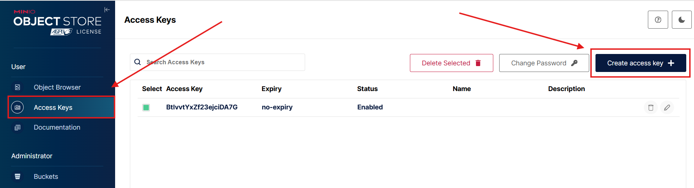
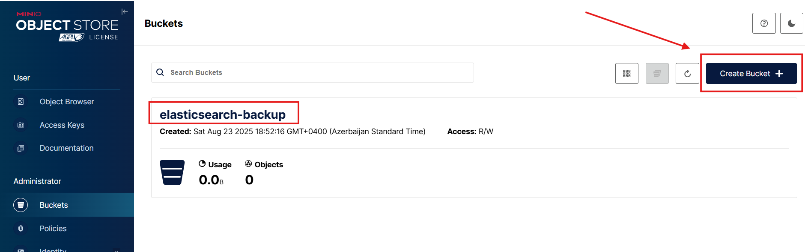
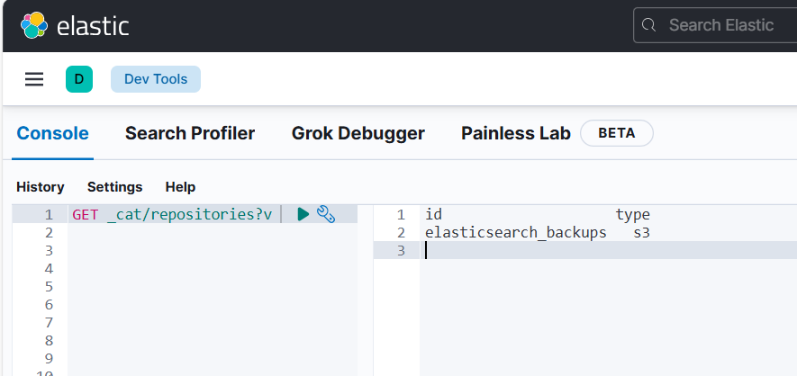
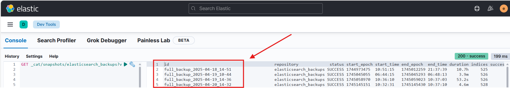
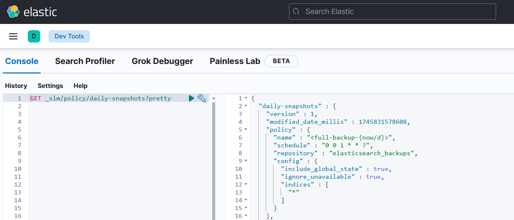

# Elasticsearch Backup & Restore with MinIO S3 Step by Step

This repository provides step-by-step documentation and examples on how to backup and restore Elasticsearch data using **MinIO** as an S3-compatible storage.

## Contents

1. Configure MinIO
2. Configure Elasticsearch
3. Register Snapshot Repository in Elasticsearch  
4. Create Backup (Snapshot)  
5. Restore from Snapshot  
6. Useful Links  

## 1. Configure MinIO

**Generate Access & Secret Keys**

In MinIO, authentication is performed using an **Access Key** and a **Secret Key**.  
These keys act like a username/password pair that allows applications (such as Elasticsearch) to connect to MinIO.

#### Steps (via MinIO Web UI):
1. Go to **Access Keys**.  
2. Click **Create access key**. 
3. MinIO will automatically generate:  
   - **Access Key** (public identifier)  
   - **Secret Key** (private password-like value)  
4. Save these credentials securely.  
  

**Create a New Bucket**

A **bucket** in MinIO is similar to a folder or container where your data is stored.  
For Elasticsearch, each snapshot is written into a designated bucket in the S3-compatible storage.

- Go to **Buckets** in the MinIO Web UI.  
- Click **Create Bucket**.  
- Enter a descriptive name, for example:  
  - `elasticsearch-backup` → general Elasticsearch snapshots 



**Note:**  
If you have not installed MinIO yet, you can install it in your preferred mode by following the official documentation:  
👉 [Install MinIO on Linux](https://docs.min.io/enterprise/aistor-object-store/installation/linux/install/)

## 2. Configure Elasticsearch

**Install S3 Plugin and Configure Keystore on Elasticsearch**

In order to enable snapshot and restore functionality with MinIO (S3-compatible storage), you must install the `repository-s3` plugin and configure Elasticsearch keystore with the appropriate credentials.

```bash
/usr/share/elasticsearch/bin/elasticsearch-plugin install repository-s3 --batch
```

>⚠️ After installation, you must restart Elasticsearch for the changes to take effect.

```bash
systemctl restart elasticsearch

#Verify Installed Plugins
curl -X GET "http://<elasticsearch-ip>:9200/_cat/plugins?v"
```

Or check directly on the server:

```bash
/usr/share/elasticsearch/bin/elasticsearch-plugin list
ls /usr/share/elasticsearch/modules/
```

**Configure Elasticsearch Keystore**

Check available keystore entries:

```bash
/usr/share/elasticsearch/bin/elasticsearch-keystore list

#Add MinIO credentials (Access Key and Secret Key) to the keystore:
/usr/share/elasticsearch/bin/elasticsearch-keystore add s3.client.default.access_key
/usr/share/elasticsearch/bin/elasticsearch-keystore add s3.client.default.secret_key
```

When prompted, enter your MinIO Access Key and Secret Key.

Verify Keystore Configuration

```bash
/usr/share/elasticsearch/bin/elasticsearch-keystore list
```

You should now see the newly added S3 client entries.

## 3. Register Snapshot Repository in Elasticsearch

In order to store Elasticsearch snapshots in MinIO (S3-compatible storage), you must first register a **snapshot repository**. A repository is simply a logical pointer inside Elasticsearch that tells it *where* to store snapshots.

### Create the Repository

Run the following command to create a repository:

```bash
curl -X PUT "http://<elasticsearch-ip>:9200/_snapshot/elasticsearch_backups" \
-H 'Content-Type: application/json' \
-d '{
  "type": "s3",
  "settings": {
    "bucket": "elasticsearch-backups",
    "endpoint": "http://<minio-ip>:9000",
    "protocol": "http",
    "path_style_access": true
  }
}'
```

**Explanation of parameters:**

- **type:** Must be s3 because MinIO is S3-compatible.

- **bucket:** The MinIO bucket you created earlier (e.g., elasticsearch-backup).

- **endpoint:** The URL of your MinIO server (default: http://your-minio-server-ip:9000).

- **protocol:** Use http unless MinIO is configured with TLS (https).

- **path_style_access:** Must be true for MinIO compatibility (forces path-style URLs).

**Verify that the repository was successfully registered:**

```bash
curl -X GET "http://<elasticsearch-ip>:9200/_cat/repositories?v "
#see more detail
curl -X GET "http://<elasticsearch-ip>:9200/_snapshot/elasticsearch_backups?pretty"
```


## 4. Create Backup (Snapshot)

Once you have successfully registered your snapshot repository in Elasticsearch, you can proceed to create backups (snapshots) of your data. Snapshots are essentially point-in-time copies of your indices, which can be restored later if needed.

### 1. Create a Snapshot of Elasticsearch Indices

To create a snapshot of your Elasticsearch indices, run the following command:

```bash
curl -X PUT "http://<elasticsearch-ip>:9200/_snapshot/elasticsearch_backups/full_backup_$(date +%F_%H-%M)" \
-H "Content-Type: application/json" -d '{
  "indices": "*",
  "ignore_unavailable": true,
  "include_global_state": true
}'
```

**Explanation of Parameters:**

- **elasticsearch_backup:** This is the name of the snapshot repository that you registered earlier.

- **full_backup_$(date +%F_%H-%M):** The snapshot name is dynamically generated using the current date and time, ensuring a unique name for each snapshot.

**Verify Snapshot Creation**

To verify that the snapshot has been successfully created, run the following command:

```bash
curl -X GET "http://<elasticsearch-ip>:9200/_cat/snapshots/elasticsearch_backups?v"
```

This will return the list of snapshots, including the status of each snapshot, ensuring that your backup has been completed successfully.



Notes:

- Snapshots are stored in the MinIO bucket you configured (elasticsearch-backup).

- The snapshots are incremental, meaning only the data that has changed since the last snapshot is stored, optimizing storage usage.

- It is a good practice to regularly schedule snapshots to ensure you have recent backups of your Elasticsearch indices.

### 2.Daily Snapshot: Create a Snapshot Lifecycle Management (SLM) Policy

The Snapshot Lifecycle Management (SLM) policy allows you to automate the creation of snapshots on a regular schedule. In this case, we're creating a policy that triggers a daily backup of all indices.

**Create the SLM Policy for Daily Backups**

Run the following command to create a daily snapshot policy:

```bash
curl -X PUT "http://<elasticsearch-ip>:9200/_slm/policy/daily-snapshots" \
-H 'Content-Type: application/json' \
-d '{
  "name": "<full-backup-{now/d}>",
  "schedule": "0 0 * * * ?",
  "repository": "elasticsearch_backups",
  "config": {
    "indices": ["*"],
    "ignore_unavailable": true,
    "include_global_state": true
  }
}'
```

**Check the Status of the SLM Policy**

To check the status of the daily-snapshots policy, run the following command:

```bash
curl -X GET "http://<elasticsearch-ip>:9200/_slm/policy/daily-snapshots?pretty"
```




## 5. Restore a Snapshot from the MinIO Backup

To restore data from a snapshot, Elasticsearch uses the restore operation. Below is the command to restore a snapshot stored in MinIO backup to Elasticsearch.

Use the following POST command to restore the snapshot into Elasticsearch:

```bash
curl -X POST "http://<elasticsearch-ip>:9200/_snapshot/elasticsearch_backups/backup_name/_restore" -H "Content-Type: application/json" -d '{
  "indices": "*",
  "ignore_unavailable": true,
  "include_global_state": true  
}'
```

After restoring the snapshot, you can check the status of the recovery process by running the following command:

```bash
curl -s "http://<elasticsearch-ip>:9200/_cat/recovery?v"
```

## 6. Useful Links

[Elasticsearch Snapshot and Restore Documentation](https://www.elastic.co/docs/api/doc/elasticsearch/v8/group/endpoint-snapshot)

- [MinIO Installation Guide](https://docs.min.io/enterprise/aistor-object-store/installation/linux/install/)

- [Elasticsearch SLM (Snapshot Lifecycle Management)](https://www.elastic.co/guide/en/elasticsearch/reference/current/getting-started-snapshot-lifecycle-management.html)

- [MinIO Client (mc) Tool Documentation](https://min.io/docs/minio/linux/reference/minio-mc.html)